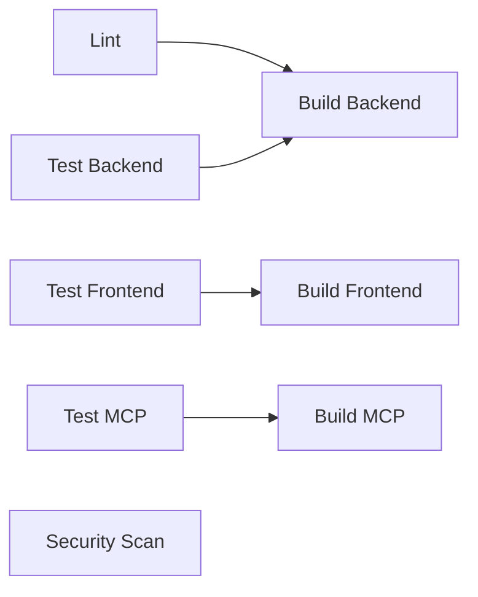
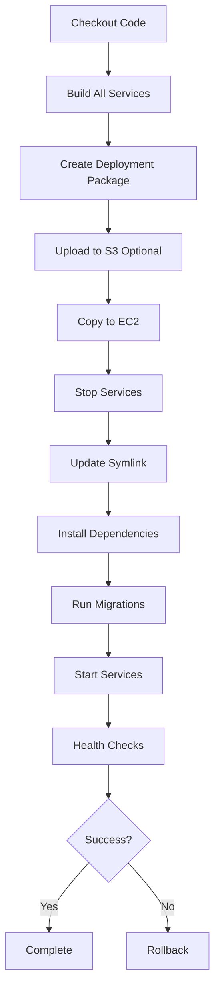

# FoodBot CI/CD Pipeline Guide

Complete guide for the GitHub Actions CI/CD pipeline deploying to AWS EC2.

## Overview

The FoodBot project uses GitHub Actions for continuous integration and deployment to AWS EC2. The pipeline consists of two main workflows:

1. **CI Workflow** (`ci.yml`) - Runs on every push/PR
2. **CD Workflow** (`deploy-aws.yml`) - Deploys to AWS on main branch pushes

## CI Workflow

### Triggers
- Push to `main` or `develop` branches
- Pull requests targeting `main` or `develop`

### Jobs



#### 1. Lint & Type Check
- Runs ESLint on all code
- Checks Prettier formatting
- Runs TypeScript compiler in no-emit mode
- **Duration**: ~2-3 minutes

#### 2. Backend Tests
- Spins up PostgreSQL and Redis containers
- Runs unit and integration tests
- Generates coverage report
- Uploads to Codecov
- **Duration**: ~5-8 minutes

#### 3. Frontend Tests
- Runs Jest tests with React Testing Library
- Generates coverage report
- Uploads to Codecov
- **Duration**: ~3-5 minutes

#### 4. MCP Tests
- Runs Maven tests for Spring Boot service
- **Duration**: ~3-5 minutes

#### 5. Build Steps
- Builds backend (NestJS)
- Builds frontend (React)
- Builds MCP service (Spring Boot JAR)
- Uploads artifacts for deployment
- **Duration**: ~5-7 minutes

#### 6. Security Scan
- Runs `npm audit` on dependencies
- Optional: Snyk security scan
- **Duration**: ~2-3 minutes

#### 7. E2E Tests (Main Branch Only)
- Runs Playwright end-to-end tests
- Full stack testing with services
- **Duration**: ~10-15 minutes

### Total CI Time
- **PR/Branch Push**: ~15-20 minutes
- **Main Branch Push**: ~25-35 minutes (includes E2E)

## CD Workflow (Deployment)

### Triggers
- Push to `main` branch
- Manual workflow dispatch (any branch)

### Deployment Steps



### Deployment Process

#### 1. Build Phase (5-7 minutes)
```bash
- Setup Node.js, Java
- Install dependencies
- Build backend (NestJS)
- Build frontend (React → static files)
- Build MCP (Spring Boot → JAR)
- Create tarball
```

#### 2. Transfer Phase (1-2 minutes)
```bash
- Configure AWS credentials
- Upload to S3 (optional)
- SCP to EC2 server
```

#### 3. Deployment Phase (3-5 minutes)
```bash
- Extract package to releases directory
- Stop running services
- Create symlink to new release
- Install production dependencies
- Run database migrations
- Start services
```

#### 4. Verification Phase (1 minute)
```bash
- Wait for services to initialize
- Run health checks:
  - Backend: http://localhost:3000/api/v1/health
  - Frontend: http://localhost:3001/
  - MCP: http://localhost:8080/actuator/health
- Verify via public URL
```

#### 5. Rollback on Failure
```bash
- Automatic rollback if any check fails
- Reverts symlink to previous release
- Restarts services
- Verifies rollback success
```

### Total Deployment Time
- **Successful Deployment**: ~12-15 minutes
- **With Rollback**: ~15-18 minutes

## Manual Deployment

### Via GitHub Actions UI

1. Go to Actions tab in GitHub
2. Select "Deploy to AWS EC2" workflow
3. Click "Run workflow"
4. Select branch and environment
5. Click "Run workflow"

### Via GitHub CLI

```bash
gh workflow run deploy-aws.yml \
  --ref main \
  --field environment=production
```

## Rollback Procedure

### Automatic Rollback
Triggered automatically if:
- Build fails
- Health checks fail
- Service start fails

### Manual Rollback

#### Via SSH
```bash
ssh ubuntu@<EC2_IP>
cd /home/ubuntu/foodbot
./scripts/rollback.sh
```

#### Via GitHub Actions
```bash
# SSH to server
ssh ubuntu@<EC2_IP>

# List releases
ls -lt /home/ubuntu/foodbot/releases/

# Manually rollback to specific release
sudo systemctl stop foodbot-*
ln -sfn /home/ubuntu/foodbot/releases/YYYYMMDD_HHMMSS/deploy-package /home/ubuntu/foodbot/current
sudo systemctl start foodbot-*
```

## Environment Variables

### CI Environment
Set in workflow file:
```yaml
env:
  NODE_ENV: test
  DB_HOST: localhost
  JWT_SECRET: ci-test-jwt-secret
```

### Production Environment
Stored in `/home/ubuntu/foodbot/.env` on EC2:
```bash
NODE_ENV=production
DB_HOST=localhost
DB_PORT=5432
JWT_SECRET=<from-github-secrets>
```

## Monitoring Deployments

### GitHub Actions
- View workflow runs: Repository → Actions
- Check logs for each step
- Download artifacts

### EC2 Server
```bash
# View service status
sudo systemctl status foodbot-backend
sudo systemctl status foodbot-frontend
sudo systemctl status foodbot-mcp

# View logs
sudo journalctl -u foodbot-backend -f
sudo journalctl -u foodbot-frontend -f
sudo journalctl -u foodbot-mcp -f

# View deployment history
ls -lt /home/ubuntu/foodbot/releases/

# Check current release
readlink /home/ubuntu/foodbot/current
```

### Application Logs
```bash
# Backend logs
tail -f /home/ubuntu/foodbot/shared/logs/backend.log

# Frontend logs (via Nginx)
tail -f /var/log/nginx/access.log
tail -f /var/log/nginx/error.log
```

## Troubleshooting

### Deployment Fails at "Copy to EC2"

**Cause**: SSH connection issues

**Solution**:
```bash
# Verify SSH key in GitHub Secrets
# Test SSH connection locally
ssh -i ~/.ssh/your-key.pem ubuntu@<EC2_IP>

# Check EC2 security group allows SSH from GitHub Actions IPs
# GitHub Actions uses dynamic IPs, consider using VPN or bastion host
```

### Build Fails

**Cause**: Dependency issues or test failures

**Solution**:
```bash
# Run locally to reproduce
pnpm install
pnpm test
pnpm run build

# Fix issues and push again
```

### Health Check Fails

**Cause**: Service not starting properly

**Solution**:
```bash
# SSH to server
ssh ubuntu@<EC2_IP>

# Check service logs
sudo journalctl -u foodbot-backend -n 100

# Check if ports are available
sudo lsof -i :3000
sudo lsof -i :3001
sudo lsof -i :8080

# Manually restart
sudo systemctl restart foodbot-backend
```

### Database Migration Fails

**Cause**: Migration script error or database connection issue

**Solution**:
```bash
# Check database connection
psql -h localhost -U foodbot_user -d foodbot

# Manually run migrations
cd /home/ubuntu/foodbot/current/backend
npm run migration:run

# Check migration history
npm run migration:show
```

## Performance Optimization

### Parallel Jobs
CI workflow runs jobs in parallel:
- Lint + Tests run concurrently
- Builds wait for their respective tests

### Caching
- npm/pnpm dependencies cached
- Maven dependencies cached
- Build artifacts cached between jobs

### Artifact Optimization
- Only necessary files uploaded
- Compression used for artifacts
- Retention set to 3-7 days

## Security Best Practices

### Secrets Management
- All secrets stored in GitHub Secrets
- Secrets not exposed in logs
- Rotation schedule maintained

### SSH Access
- Key-based authentication only
- No password authentication
- Keys rotated every 180 days

### Deployment Security
- Services run as non-root user
- SystemD security features enabled
- Nginx security headers configured

## Continuous Improvement

### Metrics to Track
- Deployment frequency
- Lead time for changes
- Mean time to recovery (MTTR)
- Change failure rate

### Future Enhancements
- [ ] Blue-green deployment
- [ ] Canary releases
- [ ] Automated smoke tests
- [ ] Performance testing in CI
- [ ] Docker containerization
- [ ] Kubernetes deployment
- [ ] Multi-region deployment

## Support

### Documentation
- [AWS Setup Guide](./AWS_SETUP.md)
- [GitHub Secrets Guide](./GITHUB_SECRETS.md)
- [Deployment Scripts](../scripts/)

### Getting Help
1. Check workflow logs in GitHub Actions
2. Check EC2 system logs
3. Review application logs
4. Contact DevOps team

---

**Last Updated**: 2026-02-19
**Maintained By**: DevOps Team
